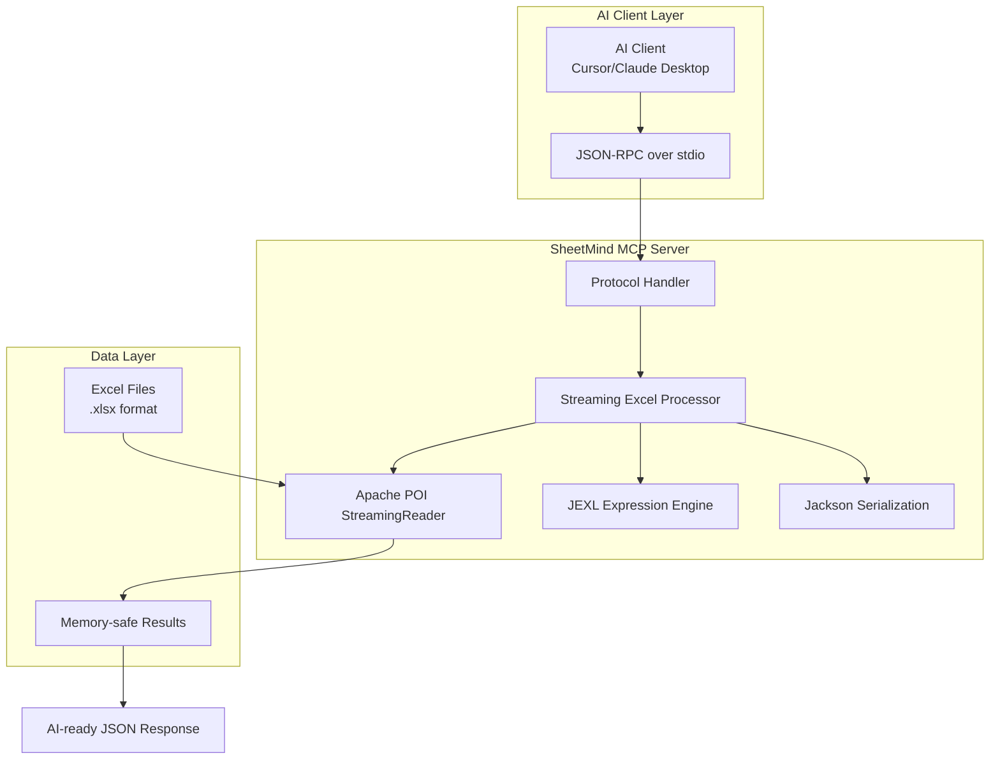

# SheetMind - 企业级 Excel MCP 服务器 / Enterprise Excel MCP Server

<p align="center">
  
  
  
  
</p>

<p align="center">
  <strong>Streaming Excel processing for AI agents • 为AI智能体设计的流式Excel处理引擎</strong>
</p>

---

## 📖 概述 / Overview

**SheetMind** 是一个基于 **Java 17** 构建的企业级 **Model Context Protocol (MCP)** 服务器，专门为处理 **大规模 Excel 文件**（百万行级别）而设计。它解决了传统Excel处理中的 **内存溢出（OOM）**、**AI幻觉计算** 和 **上下文窗口限制** 等核心问题。

**SheetMind** is an **enterprise-grade Model Context Protocol (MCP)** server built on **Java 17**, specifically designed for processing **large-scale Excel files** (millions of rows). It addresses core issues in traditional Excel processing: **memory overflow (OOM)**, **AI hallucination calculations**, and **context window limitations**.

### 🎯 核心价值 / Core Value Proposition

| 优势 / Advantage | 描述 / Description |
|-----------------|-------------------|
| **内存安全**<br>**Memory Safe** | O(1) 内存复杂度，文件大小不影响内存占用<br>O(1) memory complexity, file size does not affect memory usage |
| **流式处理**<br>**Streaming Processing** | 基于 Apache POI StreamingReader，支持百万行文件<br>Based on Apache POI StreamingReader, supports million-row files |
| **智能过滤**<br>**Intelligent Filtering** | JEXL 表达式引擎，AI可用自然语言描述查询条件<br>JEXL expression engine, AI can describe queries in natural language |
| **原子操作**<br>**Atomic Operations** | 自动备份与原子文件替换，保障数据安全<br>Automatic backup and atomic file replacement for data safety |
| **标准协议**<br>**Standard Protocol** | MCP Stdio 协议，兼容 Cursor、Claude Desktop 等 AI 客户端<br>MCP Stdio protocol, compatible with Cursor, Claude Desktop, and other AI clients |

---

## 🏗️ 架构设计 / Architecture



### 📦 技术栈 / Tech Stack

| 组件 / Component | 技术选型 / Technology | 版本 / Version | 作用 / Purpose |
|-----------------|----------------------|---------------|---------------|
| **核心引擎**<br>**Core Engine** | Apache POI + Excel Streaming Reader | 5.2.5 | 流式读写 Excel 文件 |
| **协议层**<br>**Protocol Layer** | mcp-annotated-java-sdk | 0.13.0 | MCP 标准协议实现 |
| **表达式引擎**<br>**Expression Engine** | Apache JEXL 3 | 3.3 | 动态过滤表达式解析 |
| **序列化**<br>**Serialization** | Jackson Databind | 2.17.1 | JSON 序列化/反序列化 |
| **构建工具**<br>**Build Tool** | Maven 3.6+ | - | 项目构建与依赖管理 |

---

## 🛠️ 核心功能 / Core Features

### 1. 📋 工作表检查 / `inspect_spreadsheet`
获取工作表元数据和预览数据，帮助AI理解数据结构。

**输入 / Input:**
```json
{
  "filePath": "/path/to/data.xlsx"
}
```

**输出 / Output:**
```json
{
  "success": true,
  "data": {
    "fileName": "data.xlsx",
    "sheetName": "SalesData",
    "previewRowCount": 5,
    "columnCount": 9,
    "headers": ["ID", "Product", "Category", "Region", "Price", "Quantity", "Total", "Status", "Date"],
    "preview": [...],
    "note": "Row count is based on preview only; streaming reader cannot determine total rows without full scan"
  }
}
```

### 2. 🔍 智能搜索 / `smart_search_rows`
流式搜索 + JEXL 表达式过滤，支持分页。

**输入 / Input:**
```json
{
  "filePath": "/path/to/data.xlsx",
  "query": "Price > 1000 && Status == 'Done' && Region in ['North', 'South']",
  "pagination": {
    "limit": 20,
    "offset": 0
  }
}
```

**输出 / Output:**
```json
{
  "success": true,
  "data": {
    "rowsProcessed": 150,
    "rowsFiltered": 23,
    "returnedCount": 20,
    "results": [...],
    "pagination": {
      "limit": 20,
      "offset": 0,
      "hasMore": true
    }
  }
}
```

### 3. ✏️ 单元格更新 / `update_cell`
原子单元格更新，自动备份保障数据安全。

**输入 / Input:**
```json
{
  "filePath": "/path/to/data.xlsx",
  "row": 5,
  "col": 2,
  "value": "Updated Value"
}
```

**安全机制 / Safety Features:**
- 自动创建 `.bak` 备份文件
- 文件大小限制：≤50MB（可配置）
- 临时文件写入 + 原子替换
- 失败时自动恢复备份

### 4. 📊 列统计 / `summarize_column`
数值列统计分析，支持去重计数（10k上限）。

**输入 / Input:**
```json
{
  "filePath": "/path/to/data.xlsx",
  "column": "E"  // 或 "4"（列索引）/ or "4" (column index)
}
```

**输出 / Output:**
```json
{
  "success": true,
  "data": {
    "columnName": "Price",
    "columnIndex": 4,
    "totalRows": 1000,
    "sum": 1250000.50,
    "average": 1250.50,
    "min": 50.00,
    "max": 2000.00,
    "uniqueCount": 850,
    "uniqueCountNote": "Unique count capped at 10000; actual unique values may be higher"
  }
}
```

---

## 🚀 快速开始 / Quick Start

### 系统要求 / Prerequisites
- **Java**: 11 或更高版本 / 11 or higher
- **Maven**: 3.6+（构建工具）/ 3.6+ (build tool)

### 构建项目 / Build the Project
```bash
# 克隆仓库 / Clone repository
git clone https://github.com/Raclez/sheetmind.git
cd sheetmind

# 构建项目 / Build project
cd sheetmind-mcp
mvn clean package

# 生成可执行 JAR
# Build produces: target/sheetmind-mcp-1.0-SNAPSHOT-jar-with-dependencies.jar
```

### 集成到 AI 客户端 / Integration with AI Clients

#### **OpenClaw 配置 / OpenClaw Configuration**
```json
{
  "mcpServers": {
    "sheetmind": {
      "command": "java",
      "args": [
        "-jar",
        "/absolute/path/to/sheetmind-mcp/target/sheetmind-mcp-1.0-SNAPSHOT-jar-with-dependencies.jar"
      ],
      "env": {}
    }
  }
}
```

#### **Claude Desktop 配置 / Claude Desktop Configuration**
```json
{
  "mcpServers": {
    "sheetmind": {
      "command": "java",
      "args": [
        "-jar",
        "/path/to/sheetmind-mcp-1.0-SNAPSHOT-jar-with-dependencies.jar"
      ]
    }
  }
}
```

---

## 📈 性能指标 / Performance Metrics

| 指标 / Metric | 数值 / Value | 说明 / Description |
|--------------|-------------|-------------------|
| **文件大小支持**<br>**File Size Support** | ≤150MB（实测）<br>≤150MB (tested) | 1百万行销售数据 |
| **内存占用**<br>**Memory Usage** | <50MB（常量）<br><50MB (constant) | O(1) 内存复杂度 |
| **处理速度**<br>**Processing Speed** | ~10,000 行/秒<br>~10,000 rows/sec | 现代硬件配置 |
| **表达式性能**<br>**Expression Performance** | ~1,000 行/秒<br>~1,000 rows/sec | 包含JEXL表达式过滤 |
| **并发支持**<br>**Concurrency Support** | 多实例部署<br>Multi-instance deployment | 无状态设计 |

### 🧠 内存管理最佳实践 / Memory Management Best Practices

```java
// ✅ 正确做法 - 流式处理 / CORRECT - Streaming
try (Workbook workbook = StreamingReader.builder()
        .rowCacheSize(100)
        .bufferSize(4096)
        .open(file)) {
    // 逐行处理 / Process row by row
}

// ❌ 错误做法 - 全量加载 / WRONG - Full load
Workbook workbook = WorkbookFactory.create(file); // OOM风险 / OOM risk
```

---

## 🔧 高级配置 / Advanced Configuration

### 环境变量 / Environment Variables
```bash
# 内存限制 / Memory limits
export SHEETMIND_JAVA_OPTS="-Xmx512m -Xms128m"

# 日志级别 / Log level
export SHEETMIND_LOG_LEVEL="INFO"
```

### 配置文件 / Configuration File (planned)
```yaml
sheetmind:
  limits:
    updateFileSize: 52428800  # 50MB
    uniqueValues: 10000
    previewRows: 5
    defaultSearchLimit: 20
  
  streaming:
    rowCacheSize: 100
    bufferSize: 4096
  
  security:
    allowedPaths: ["/data/excel", "/tmp"]
    maxConcurrent: 10
```

---

## 🧪 测试与示例 / Testing & Examples

### 生成示例数据 / Generate Sample Data
```bash
cd sheetmind-mcp
mvn compile
mvn exec:java -Dexec.mainClass="com.openclaw.sheetmind.ExampleDataGenerator"
# 生成: examples/sample_data.xlsx (1000行销售数据)
```

### 测试所有工具 / Test All Tools
```bash
# 1. 检查工作表 / Inspect spreadsheet
curl -X POST -H "Content-Type: application/json" -d '{
  "filePath": "examples/sample_data.xlsx"
}' http://localhost:8080/inspect_spreadsheet

# 2. 智能搜索 / Smart search
curl -X POST -H "Content-Type: application/json" -d '{
  "filePath": "examples/sample_data.xlsx",
  "query": "Price > 100 && Region == \"North\"",
  "pagination": {"limit": 5, "offset": 0}
}' http://localhost:8080/smart_search_rows

# 3. 更新单元格 / Update cell
curl -X POST -H "Content-Type: application/json" -d '{
  "filePath": "examples/sample_data.xlsx",
  "row": 10,
  "col": 3,
  "value": "TEST_UPDATE"
}' http://localhost:8080/update_cell

# 4. 列统计 / Summarize column
curl -X POST -H "Content-Type: application/json" -d '{
  "filePath": "examples/sample_data.xlsx",
  "column": "E"
}' http://localhost:8080/summarize_column
```

---

## 🏭 生产部署 / Production Deployment

### Docker 部署 / Docker Deployment
```dockerfile
FROM openjdk:17-jdk-slim
WORKDIR /app
COPY sheetmind-mcp/target/sheetmind-mcp-*.jar app.jar
EXPOSE 8080
ENTRYPOINT ["java", "-jar", "app.jar"]
```

### Kubernetes 配置 / Kubernetes Configuration
```yaml
apiVersion: apps/v1
kind: Deployment
metadata:
  name: sheetmind-mcp
spec:
  replicas: 3
  selector:
    matchLabels:
      app: sheetmind
  template:
    metadata:
      labels:
        app: sheetmind
    spec:
      containers:
      - name: sheetmind
        image: yourregistry/sheetmind:latest
        ports:
        - containerPort: 8080
        resources:
          limits:
            memory: "512Mi"
            cpu: "500m"
```

### 监控指标 / Monitoring Metrics (planned)
- 文件处理统计
- 内存使用情况
- 请求响应时间
- 错误率统计

---

## 📚 API 文档 / API Documentation

### 通用响应格式 / Common Response Format
```json
{
  "success": true|false,
  "data": {...},        // 成功时返回数据
  "error": "message"    // 失败时错误信息
}
```

### 错误码 / Error Codes
| 错误码 / Code | 描述 / Description | 解决方案 / Solution |
|--------------|-------------------|-------------------|
| `FILE_NOT_FOUND` | 文件不存在 | 检查文件路径 |
| `INVALID_EXPRESSION` | JEXL表达式错误 | 验证表达式语法 |
| `FILE_SIZE_EXCEEDED` | 文件超过50MB限制 | 使用其他工具或分割文件 |
| `COLUMN_OUT_OF_RANGE` | 列索引超出范围 | 检查列标识符 |
| `UPDATE_FAILED` | 单元格更新失败 | 检查文件权限和格式 |

---

## 🔄 开发指南 / Development Guide

### 项目结构 / Project Structure
```
sheetmind/
├── sheetmind-mcp/                 # 主模块 / Main module
│   ├── src/main/java/com/openclaw/sheetmind/
│   │   └── SheetMindServer.java   # 主服务器类
│   ├── src/test/java/com/openclaw/sheetmind/
│   │   └── ExampleDataGenerator.java  # 测试数据生成器
│   ├── examples/                  # 示例文件
│   ├── pom.xml                    # Maven配置
│   └── README.md                  # 模块文档（保留）
├── .gitignore
├── LICENSE
└── README.md                      # 项目主文档（本文件）
```

### 添加新工具 / Adding New Tools
1. 在 `SheetMindServer` 类中添加 `@McpTool` 注解的方法
2. 实现流式I/O处理逻辑
3. 返回JSON格式响应
4. 添加单元测试
5. 更新文档

### 构建与测试 / Build & Test
```bash
# 完整构建 / Full build
mvn clean package

# 运行测试 / Run tests
mvn test

# 代码质量检查 / Code quality check
mvn checkstyle:check
mvn pmd:check
```

---

## 🤝 贡献指南 / Contributing

我们欢迎各种形式的贡献！/ We welcome contributions of all kinds!

### 贡献流程 / Contribution Process
1. **Fork 仓库** / Fork the repository
2. **创建特性分支** / Create feature branch: `git checkout -b feature/your-feature`
3. **提交更改** / Commit changes: `git commit -m 'Add some feature'`
4. **推送到分支** / Push to branch: `git push origin feature/your-feature`
5. **创建 Pull Request** / Create Pull Request

### 开发规范 / Development Standards
- 遵循 Java 编码规范 / Follow Java coding conventions
- 添加单元测试 / Add unit tests
- 更新相关文档 / Update relevant documentation
- 保持向后兼容性 / Maintain backward compatibility

---

## 📄 许可证 / License

本项目基于 **Apache License 2.0** 许可证开源。/ This project is open source under the **Apache License 2.0**.

```
Copyright 2026 Raclez

Licensed under the Apache License, Version 2.0 (the "License");
you may not use this file except in compliance with the License.
You may obtain a copy of the License at

    http://www.apache.org/licenses/LICENSE-2.0

Unless required by applicable law or agreed to in writing, software
distributed under the License is distributed on an "AS IS" BASIS,
WITHOUT WARRANTIES OR CONDITIONS OF ANY KIND, either express or implied.
See the License for the specific language governing permissions and
limitations under the License.
```

---

## 📞 支持与联系 / Support & Contact

### 问题反馈 / Issue Reporting
- **GitHub Issues**: [https://github.com/Raclez/sheetmind/issues](https://github.com/Raclez/sheetmind/issues)
- **优先处理** / Priority handling: 安全漏洞、数据丢失、崩溃问题

### 社区 / Community
- **Discord**: [加入讨论](https://discord.gg/clawd)
- **Email**: [通过 GitHub Issues 联系]

### 商业支持 / Commercial Support
如需企业级支持、定制开发或咨询，请联系项目维护者。

---

## 🌟 致谢 / Acknowledgments

- **Apache POI** 团队提供优秀的 Excel 处理库
- **MCP** 社区推动 AI 工具互操作标准
- **所有贡献者** 的代码和反馈

---

<p align="center">
  <strong>SheetMind</strong> - 让AI更智能地处理Excel，一行流式处理，无限可能。<br/>
  <strong>SheetMind</strong> - Making AI smarter with Excel, one streaming row at a time.
</p>

<p align="center">
  <sub>Built with ❤️ by Raclez • 基于 Java 17 • Apache 2.0 Licensed</sub>
</p>